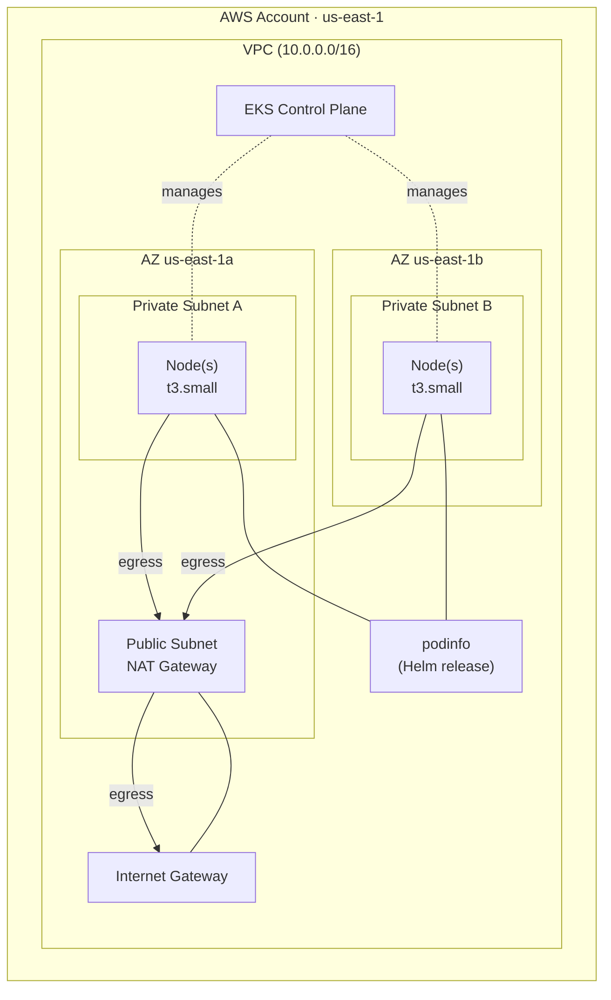
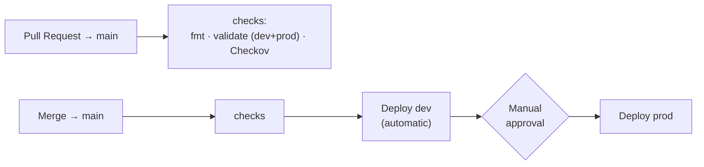

# AWS EKS Terraform Example
 
This repository is a portfolio piece. It is intended to demonstrate how I approach
infrastructure as code: reusable modules, clean environment separation, and a pipeline that treats `dev` and `prod` differently on purpose. It runs a lightweight demo workload ([podinfo](https://github.com/stefanprodan/podinfo))
so the focus stays on the platform underneath, not the app on top.

This project provisions Amazon EKS platform, VPC networking, a managed Kubernetes cluster, and an
in-cluster application. This is all done using Terraform and deployment is automated through a GitHub Actions CI/CD pipeline with formatting checks, security scanning, and a gated production deploy.
 
---
 
## Tech stack
 
- **Terraform**
- **Amazon EKS**
- **Helm**
- **GitHub Actions**
- **Checkov**
- **S3**
- **AWS Networking**
---
 
## Architecture
 
> Diagrams are authored in Mermaid so they render natively on GitHub and stay
> version-controlled alongside the code rather than living in a separate design tool.
 

 
**Network.** A VPC with one public subnet (hosting the NAT gateway and internet
gateway) and two private subnets spread across two Availability Zones. EKS
requires subnets in at least two AZs. Worker nodes run in the private subnets and
reach the internet for image pulls through the NAT gateway.
 
**Compute.** An EKS control plane plus a managed node group. Cluster authentication
uses EKS access entries (the current model) rather than the legacy `aws-auth`
ConfigMap. The core add-ons (CoreDNS, kube-proxy, VPC CNI) are managed as EKS
add-ons, with the VPC CNI installed before the node group to avoid a bootstrap
race where nodes come up before pod networking is ready.
 
**Workload.** A single Helm release (`podinfo`) deployed into its own namespace,
standing in for a real application to prove the platform delivers a running workload.
 
---
 
## Repository structure
 
```
terraform/
├── modules/
│   ├── vpc/
│   ├── eks/
│   └── workloads/
└── envs/
    ├── dev/
    └── prod/
.github/
└── workflows/
    └── terraform.yaml
```
 
Each environment under `envs/` is a thin composition layer that wires the modules
together with environment specific values (CIDR ranges, cluster name) and owns its
own remote state. The reusable logic lives entirely in `modules/`.
 
---
 
## How it works
 
Modules are reusable and the environments compose them. `dev` and `prod` call the same
`vpc`, `eks`, and `workloads` modules and differ only in inputs, CIDR blocks
(`10.0.0.0/16` vs `10.10.0.0/16`), cluster name, and state key. Adding a third
environment like staging or something is just a matter of adding a new `envs/` folder, not new infrastructure code.
 
Remote state is isolated per environment. Both environments use a single S3
bucket with separate state keys (`dev`, `prod`) and native S3 state locking.
Separate keys give each environment fully independent state and locks; a shared
bucket is fine because the isolation comes from the key, not the bucket.
 
---
 
## CI/CD pipeline
 

 
- **On every pull request:** run `terraform fmt -check`, `terraform validate` against
  both environments (credential-free, using `-backend=false`), and a Checkov
  security scan. No cloud access is touched this is pure static validation.
- **On merge to `main`:** re-run the checks, then automatically apply `dev`.
- **Production is gated.** The `prod` deploy depends on a successful `dev` deploy and
  is bound to a protected GitHub Environment with a required reviewer, so it
  pauses for manual approval before applying. Concurrency groups prevent two applies
  from racing on the same state file.

---
 
## Design decisions & trade-offs
 
This is a demonstration environment, and several choices deliberately favor
simplicity and low cost over full production hardening. Each is called out honestly
below alongside what a production version would do.
 
| Decision | Rationale in this project | Production approach |
|---|---|---|
| **Single NAT gateway** shared across both AZs | One NAT is cheaper to run in a test environment | One NAT gateway per AZ, so a single-AZ failure can't cut off the other subnet's egress |
| **Public EKS API endpoint** (`0.0.0.0/0`) | Lets CI and a local machine reach the cluster without a bastion or VPN | Restrict the public CIDR list, or use a private endpoint reached through a bastion / VPN |
| **Small node group** (`t3.small`, desired 1) | Keeps compute cost minimal while demonstrating the pattern | Right-sized instances and autoscaling tuned to real workload demand |
| **Static AWS keys** in GitHub secrets | Simplest way to authenticate CI to AWS | GitHub OIDC federation — CI assumes a role via short-lived tokens, no long-lived credentials stored |
| **Helm provider** for workload delivery | Provisions cluster and app in a single Terraform apply | A pull-based GitOps controller (Argo CD / Flux) that reconciles from Git |
| **`enable_cluster_creator_admin_permissions`** | Convenient admin access for whoever applies | Explicit `access_entries` keyed to fixed IAM ARNs, independent of who runs the apply |
 
---
 
## Getting started
 
Prerequisites: Terraform, the AWS CLI (v2), and credentials with permissions to
create VPC/EKS/IAM resources.
 
```bash
# Deploy the dev environment
cd terraform/envs/dev
terraform init
terraform apply
 
# Point kubectl at the new cluster
aws eks update-kubeconfig --region us-east-1 --name dev-eks
kubectl get nodes
 
# See the workload
kubectl -n podinfo port-forward svc/podinfo 8080:9898
# open http://localhost:8080
```

You should see:

 
---
 
## Future improvements
 
- **True GitOps delivery** — introduce Argo CD (or Flux) so applications
  reconcile from Git rather than being applied by Terraform, separating platform
  provisioning from workload delivery.
- **OIDC-based CI authentication** — replace static AWS keys with GitHub OIDC and a
  short-lived assumed role, eliminating long-lived credentials entirely.
- **Plan-on-PR** — surface a `terraform plan` diff as a PR comment and apply the
  saved plan on merge, so the exact change is reviewed before it runs.
- **Per-AZ NAT gateways** for network high availability.
- **External exposure** — add the AWS Load Balancer Controller and an Ingress to
  serve the workload through an ALB instead of port-forwarding.
- **Deeper CI checks** — add `tflint`, `tfsec`, and cost estimation, and promote the
  Checkov scan from advisory to a hard gate once findings are triaged. Currently there are some Checkov alerts in the pipeline that I would require to be fixed in production, but they are fine in the test environment.
